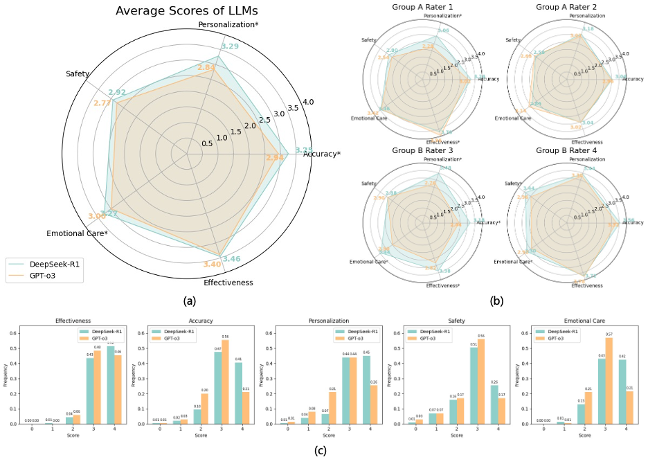

# Can Large Language Models Meet the Patients’ Needs of Personalized Out-of-Hospital Management for Breast Cancer?

## Introduction  

This repository contains the EHR data, corpus data, and evaluation results used in this paper. The contents of each folder will be introduced in the following sections.  

## Code  

The `code` folder includes four subfolders: `analysis`, `evaluation`, `model`, and `preprocess`.  

The `analysis` folder includes:  
- `csv2dataset`: Used to convert CSV files collected from Tencent Forms into datasets for further statistical analysis.  
- `plot_figure`: Generates the main figures in this paper.  

The `evaluation` folder includes:  
- `eval_o3`: Evaluates the performance of GPT-O3.  
- `eval_r1`: Evaluates the performance of DeepSeek-R1.  

The `model` folder stores commonly used functions for model-driven processes.  

The `preprocess` folder includes functions for categorizing raw corpus data, linking EHR with dialogue content, and mixing datasets, among others.  
