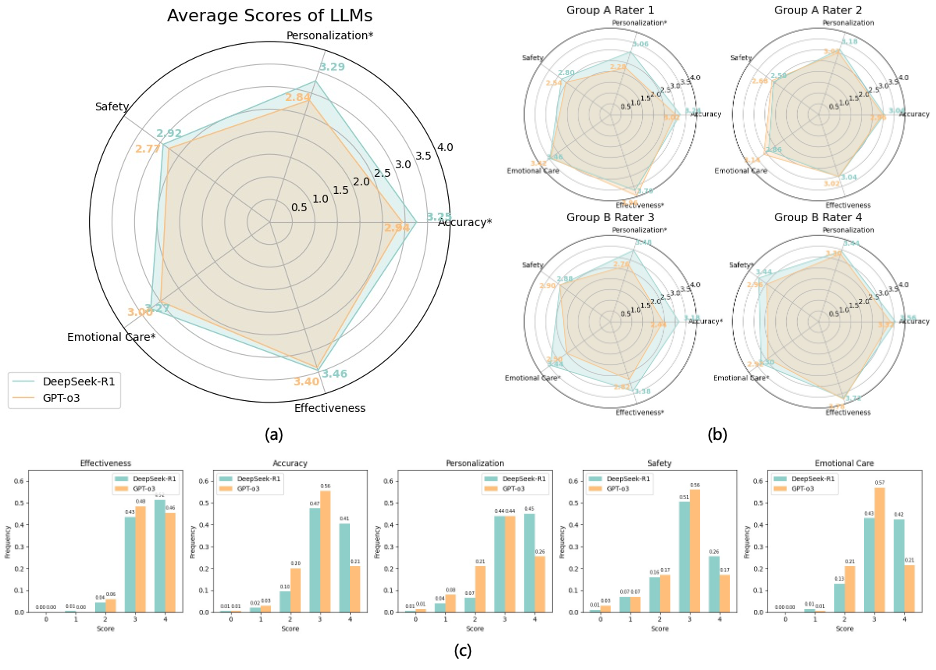

# Can Large Language Models Meet the Patients’ Needs of Personalized Out-of-Hospital Management for Breast Cancer?

## Introduction  

This repository contains the EHR data, corpus data, and evaluation results used in this paper. The contents of each folder will be introduced in the following sections.  

## Code  

The `code` folder includes four subfolders: `analysis`, `evaluation`, `model`, and `preprocess`.  

The `analysis` folder includes:  
- `csv2dataset`: Used to convert CSV files collected from Tencent Forms into datasets for further statistical analysis.  
- `plot_figure`: Generates the main figures in this paper.  
- `plot_seperated`: Plots the evaluation distributions of each assessor separately.  

The `evaluation` folder includes:  
- `eval_o3`: Evaluates the performance of GPT-O3.  
- `eval_r1`: Evaluates the performance of DeepSeek-R1.  

The `model` folder stores commonly used functions for model-driven processes.  

The `preprocess` folder includes functions for categorizing raw corpus data, linking EHR with dialogue content, and mixing datasets, among others.  

## Dataset  

The `dataset` folder stores the following data used in this paper:  
- [EHR data](dataset/EHR.xlsx)  
- [Group chat content](dataset/group_chat.json)  
- [Open-source dialogue dataset](dataset/public_qa.json)  
- [Categorized dialogue dataset](dataset/summaried_qa.json)  
- [Virtual patient information](dataset/vp_info.json)  

## Output  

The `output` folder stores the output results of each model as well as the randomly classified labels for the model results.  

## Survey Result  

The `survey_result` folder stores the evaluation results.